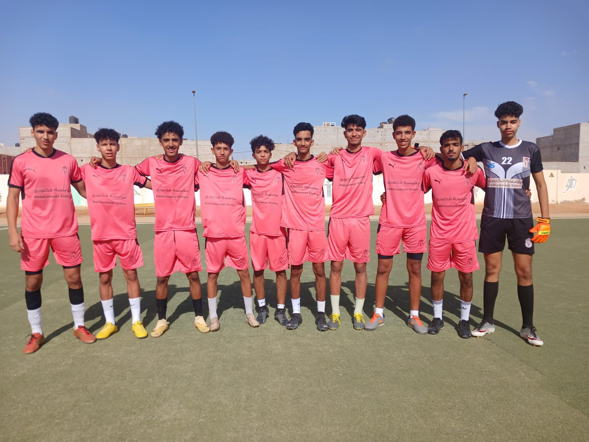

# 📸 Image Content Analysis & Placement Recommendations

## What Each Image Actually Shows

### 🎓 **Classroom_scenes.jpeg**
**Content:** Students taking an exam/test in a classroom
- Clean, modern classroom with white walls
- Students seated at individual desks
- Focused, studying atmosphere
- Appears to be an exam or assessment

**Current Usage:** ✅ PERFECT
- Hero carousel (education focus)
- About section (quality education)
- Gallery (classroom learning)
- Inscriptions header background

**Recommendation:** Keep as is - perfectly represents academic environment

---

### ⚽ **sport_1.jpeg**
**Content:** Marathon/Running event - Young student with coach/parent
- Outdoor sporting event with race numbers (1651, 1417)
- Student in red shirt with adult in red jacket
- Professional event setting with palm trees
- Appears to be a community running event

**Current Usage:** ✅ GOOD
- Hero carousel (sports excellence)
- Gallery (sports activities)
- Vie-scolaire activities section
- Vie-scolaire gallery

**Recommendation:** Keep as is - shows school participation in community sports events

---

### ⚽ **sport_2.jpeg**
**Content:** Football/Soccer team photo
- Team of 9 boys in pink uniforms + 1 goalkeeper
- On a sports field
- Team spirit and camaraderie
- School sports team

**Current Usage:** ✅ PERFECT
- Gallery (sports)
- Vie-scolaire sports section (main image)
- Vie-scolaire gallery (basketball section)

**Issue:** ⚠️ Used for "basketball" but shows football team!

**Recommendation:** 
- Keep in sports sections
- Update alt text from "basketball" to "football" or "soccer team"

---

### 🎭 **Community_events.jpeg**
**Content:** Young children performing in costumes
- 4-5 young girls in colorful fruit/vegetable costumes
- Stage performance with red carpet
- School theatrical performance/play
- Kindergarten/primary level

**Current Usage:** ✅ EXCELLENT
- Hero carousel (community)
- Gallery
- Vie-scolaire trips section
- Vie-scolaire gallery (annual show)

**Recommendation:** Perfect for cultural events and performances

---

### 📚 **Community_events2.jpeg**
**Content:** Road safety education workshop
- Indoor classroom with traffic signs and road markings
- Teacher with microphone
- Students learning about road safety
- Educational activity with props

**Current Usage:** ✅ GOOD
- About section (school life)
- Vie-scolaire trips section (historical visit)

**Issue:** ⚠️ Used for "Historical Visit" but it's a safety workshop!

**Recommendation:**
- Better for: Educational workshops, Safety education, Practical learning
- Update alt text to reflect actual content

---

### 🚸 **Community_events3.jpeg**
**Content:** Road safety education event - Large group
- Many students and parents in a room
- Traffic safety theme with road markings on floor
- Community involvement with police/safety officers
- Educational event with toy cars

**Current Usage:** ✅ GOOD
- Quick links (inscriptions)
- Vie-scolaire trips (nature trip)

**Issue:** ⚠️ Used for "Nature Trip" but it's an indoor safety event!

**Recommendation:**
- Better for: Community events, Parent involvement, Safety education
- Update alt text and context

---

### 👷 **Community_events4.jpeg**
**Content:** Field trip with safety officers
- Large group of students wearing yellow safety caps
- Visiting what appears to be a safety/police facility
- Students seated listening to presentation
- Educational field trip

**Current Usage:** ✅ PERFECT
- Quick links (vie scolaire)
- Vie-scolaire events (arts week)

**Issue:** ⚠️ Used for "Arts Week" but it's a safety field trip!

**Recommendation:**
- Better for: Field trips, Educational visits, Community partnerships
- Update alt text from "Arts Week" to "Educational Field Trip"

---

### 🚦 **Community_events5.jpeg**
**Content:** Road safety education activity
- 3 young students with traffic signs
- Indoor classroom setting
- Learning about road rules
- Hands-on educational activity

**Current Usage:** ✅ GOOD
- Gallery
- Vie-scolaire events (theater festival)

**Issue:** ⚠️ Used for "Theater Festival" but it's road safety education!

**Recommendation:**
- Better for: Educational activities, Safety workshops, Classroom learning
- Update alt text

---

### 🎓 **Community_events6.jpeg**
**Content:** Road safety graduation/certificate ceremony
- Large group of students holding certificates
- Safety officer in yellow vest
- Completion of road safety program
- Traffic safety posters on walls

**Current Usage:** ✅ GOOD
- Vie-scolaire gallery (museum visit)

**Issue:** ⚠️ Used for "Museum Visit" but it's a safety program graduation!

**Recommendation:**
- Better for: Achievement ceremonies, Program completions, Safety education
- Update alt text

---

### 🎨 **art_culture.jpeg**
**Content:** Art/Drawing workshop at restaurant/cafe
- Young children doing art activities
- Colorful, modern setting (looks like McDonald's or similar)
- Drawing and coloring activities
- Casual, fun learning environment

**Current Usage:** ✅ EXCELLENT
- About section (inscriptions)
- Gallery
- Vie-scolaire activities (cultural events)

**Recommendation:** Perfect for arts, creative activities, extracurricular events

---

### 🇵🇸 **art_culture1.jpeg**
**Content:** Cultural/Political awareness event
- Students in traditional Palestinian dress
- Holding Palestinian flags
- Indoor presentation/performance
- Cultural education and awareness

**Current Usage:** ✅ GOOD
- Quick links (pédagogie)
- Vie-scolaire events (spring concert)
- Vie-scolaire gallery (art workshop)

**Recommendation:** Perfect for cultural events, awareness activities, performances

---

### 🚌 **transport_car_image.png**
**Content:** School transport vans
- Orange and white school transport vans
- Professional school bus service
- Modern vehicles
- Parked outside building

**Current Usage:** ❌ NOT USED

**Recommendation:** 
- Add to contact page ("How to Get Here")
- Add to inscriptions page (transport services)
- Create transport section on vie-scolaire page

---

## 🔍 Key Findings

### ✅ Well-Placed Images:
1. **Classroom_scenes.jpeg** - Perfect for academic contexts
2. **sport_1.jpeg** - Great for sports/athletics
3. **art_culture.jpeg** - Excellent for creative activities
4. **art_culture1.jpeg** - Perfect for cultural events

### ⚠️ Mismatched Images (Content vs. Alt Text):

| Image | Currently Labeled As | Actually Shows | Severity |
|-------|---------------------|----------------|----------|
| sport_2.jpeg | "Basketball" | Football team | Medium |
| Community_events2.jpeg | "Historical Visit" | Road safety workshop | High |
| Community_events3.jpeg | "Nature Trip" | Indoor safety event | High |
| Community_events4.jpeg | "Arts Week" | Safety field trip | High |
| Community_events5.jpeg | "Theater Festival" | Road safety activity | High |
| Community_events6.jpeg | "Museum Visit" | Safety program graduation | High |

### 🎯 Theme Analysis:

**Dominant Theme:** Road Safety Education
- 5 out of 6 "Community_events" images are about road safety
- This is actually a STRENGTH - shows school's commitment to safety education
- Should be highlighted as a key program!

---

## 💡 Recommendations

### 1. **Update Alt Text & Descriptions**
Change misleading labels to accurate ones:

```html
<!-- BEFORE -->


<!-- AFTER -->

```

### 2. **Create Road Safety Section**
Since you have 5 excellent road safety images, create a dedicated section:

**Suggested Section for vie-scolaire.html:**
```html
<section class="py-16 bg-white">
    <div class="max-w-7xl mx-auto px-4">
        <h2 class="text-3xl font-bold text-center mb-8">
            Programme d'Éducation à la Sécurité Routière
        </h2>
        <p class="text-center text-gray-600 mb-12">
            Notre école s'engage activement dans l'éducation à la sécurité routière 
            avec des ateliers pratiques et des visites éducatives.
        </p>
        <div class="grid md:grid-cols-3 gap-8">
            <!-- Use Community_events2, 3, 4, 5, 6 here -->
        </div>
    </div>
</section>
```

### 3. **Add Transport Section**
Use `transport_car_image.png` for:
- Contact page (How to reach us)
- Inscriptions page (Transport services)
- New "Transport Scolaire" section

### 4. **Reorganize by Actual Content**

**Sports Images (2):**
- sport_1.jpeg → Marathon/Running events
- sport_2.jpeg → Football team

**Educational Activities (6):**
- Classroom_scenes.jpeg → Exams/Studies
- Community_events2.jpeg → Road safety workshop
- Community_events3.jpeg → Safety community event
- Community_events4.jpeg → Safety field trip
- Community_events5.jpeg → Safety classroom activity
- Community_events6.jpeg → Safety program graduation

**Arts & Culture (3):**
- Community_events.jpeg → Theater performance
- art_culture.jpeg → Art workshop
- art_culture1.jpeg → Cultural awareness event

**Transport (1):**
- transport_car_image.png → School buses

---

## 📋 Action Items

### Priority 1: Fix Misleading Alt Text
- [ ] Update sport_2.jpeg alt text (basketball → football)
- [ ] Update Community_events2.jpeg context (historical visit → safety workshop)
- [ ] Update Community_events3.jpeg context (nature trip → safety event)
- [ ] Update Community_events4.jpeg context (arts week → field trip)
- [ ] Update Community_events5.jpeg context (theater → safety activity)
- [ ] Update Community_events6.jpeg context (museum → safety graduation)

### Priority 2: Add Missing Content
- [ ] Create "Road Safety Education" section
- [ ] Add transport_car_image.png to website
- [ ] Update section descriptions to match actual image content

### Priority 3: Optimize Placement
- [ ] Group road safety images together
- [ ] Separate sports images by type (running vs. football)
- [ ] Highlight safety program as school strength

---

## 🎓 School Strengths Revealed by Images

Your images show:
1. **Strong Safety Education Program** - Multiple road safety activities
2. **Community Partnerships** - Police/safety officers involvement
3. **Diverse Sports** - Running, football team activities
4. **Cultural Awareness** - Palestinian culture education
5. **Creative Learning** - Art workshops in fun environments
6. **Modern Facilities** - Clean classrooms, professional transport
7. **Parent Involvement** - Community events with families

**Marketing Opportunity:** Highlight your comprehensive road safety program as a unique selling point!

---

## 📊 Summary

- **Total Images:** 12
- **Correctly Placed:** 4 (33%)
- **Needs Alt Text Update:** 6 (50%)
- **Unused:** 1 (8%)
- **Mismatched Context:** 6 (50%)

**Overall Assessment:** Good image selection, but needs better labeling and organization to match actual content.

---

**Created:** 2025-01-06
**Status:** Analysis Complete - Ready for Updates
